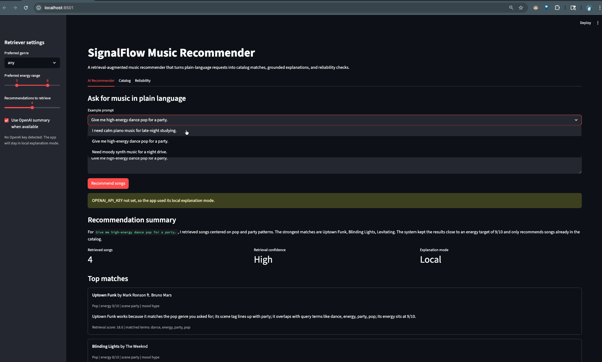

# SignalFlow Music Recommender

`SignalFlow Music Recommender` is a retrieval-augmented music recommendation app built in Streamlit. A user can describe what they want to hear in plain language, the system retrieves the closest songs from a local catalog, and the app returns grounded recommendations with transparent reasons and evaluation results.

This project builds on my original `Playlist Chaos` project from Modules 1-3. The earlier version grouped songs into mood-based playlists, let users add and search tracks, and surfaced simple listening stats. This final version turns that playlist idea into a more complete applied AI system with retrieval, guardrails, evaluation, and portfolio-ready documentation.

## Why it matters

The app demonstrates a practical AI pattern: use retrieval before generation so the system stays tied to real data. Instead of inventing songs or making vague suggestions, the recommender searches a known catalog, ranks the best matches, and only then produces an explanation.

## Engineer's Pitch

### The Problem: What did you solve?

I solved the problem of turning a simple playlist app into an AI-powered music recommender that can understand plain-language requests. Instead of making the user manually browse playlists or guess the right category, the user can type something like `I need calm piano music for late-night studying`, and the system returns songs that match the mood, activity, genre, and energy level.

Technical explanation:

The system uses a structured song catalog stored in `data/song_catalog.csv`. Each song has searchable metadata such as title, artist, genre, mood, tags, scene, energy, and description. The app converts the user's natural-language prompt into retrieval signals, then ranks catalog songs based on how well their metadata matches those signals.

### The Logic: How does the AI think?

The project uses **Retrieval-Augmented Generation (RAG)**. The AI does not start by generating an answer from memory. It first retrieves matching songs from the catalog, then optionally uses an OpenAI model to summarize the retrieved results.

Technical explanation:

The retrieval layer is implemented in `src/retrieval.py`. The `extract_intent()` function parses the prompt into a `QueryIntent`, including detected genres, scenes, moods, keywords, and target energy. Then `score_song()` scores every catalog song using weighted signals:

- genre match
- preferred genre match
- scene match
- mood match
- keyword overlap
- preferred energy range
- distance from target energy

The ranked songs become the grounding context. If OpenAI mode is enabled, `src/llm_client.py` sends only the retrieved songs and retrieval evidence to the model. The LLM is instructed not to invent songs, artists, or facts. If OpenAI is unavailable, the app uses a deterministic local summary from `src/recommender.py`.

### The Reliability: How do you know it works?

I know it works because the project includes guardrails, unit tests, benchmark evaluation, visible retrieval evidence, and a Reliability tab in the Streamlit app.

Technical explanation:

The guardrails in `validate_query()` block empty prompts, overly short prompts, and prompts longer than 240 characters. The recommender also limits outputs to songs already stored in the catalog, which prevents hallucinated recommendations.

The test suite in `tests/test_recommender.py` checks that invalid prompts are blocked and that known prompts retrieve the expected types of songs. The benchmark in `src/evaluation.py` runs fixed cases for study focus, party energy, and night driving. Each case checks expected titles, expected genres, and whether recommended songs stay inside the correct energy range.

Verified local results:

- `python3 -m unittest discover -s tests`: 4 tests passed
- `python3 -m src.evaluation`: 3 out of 3 evaluation cases passed

### The Reflection: What surprised you?

What surprised me was that the most important part of the AI system was not the optional LLM summary. The biggest improvement came from making the retrieval layer, metadata, scoring rules, and evaluation cases clear.

Technical reflection:

This showed me that RAG is only as strong as the retrieval source and scoring logic behind it. When the catalog descriptions and tags used words that matched how users naturally ask for music, the system became much more reliable. The LLM made the response sound more natural, but the deterministic retriever made the recommendations trustworthy.

## Architecture overview

The system follows this flow:

1. A user submits a natural-language prompt and optional preference settings.
2. Guardrails validate the prompt and parse genres, scenes, moods, and target energy.
3. The retriever ranks songs from `data/song_catalog.csv`.
4. The explanation layer returns grounded reasons for each recommendation.
5. The reliability tab and evaluation script test fixed prompts against expected results.

Mermaid source for the system diagram is in [assets/system_architecture.mmd](assets/system_architecture.mmd), and the rendered submission image is saved as [assets/system_architecture.png](assets/system_architecture.png).


## Required AI features implemented

This project implements **Retrieval-Augmented Generation (RAG)** and a **Reliability or Testing System**.

| Required feature | Implemented? | Where it appears |
|---|---:|---|
| Retrieval-Augmented Generation (RAG) | Yes | `src/retrieval.py`, `src/recommender.py`, `src/llm_client.py` |
| Agentic Workflow | No | The system does not autonomously plan, act, test itself, and revise its own work. |
| Fine-Tuned or Specialized Model | No | The project uses retrieval rules and an optional OpenAI model, but no model is fine-tuned. |
| Reliability or Testing System | Yes | `tests/test_recommender.py`, `src/evaluation.py`, and the Streamlit Reliability tab |

### How RAG is implemented

RAG means the AI retrieves relevant information before generating an answer. In `SignalFlow`, the retrieved information is a ranked set of songs from `data/song_catalog.csv`.

The RAG flow works like this:

1. The user enters a prompt such as `I need calm piano music for late-night studying.`
2. `validate_query()` in `src/recommender.py` checks the prompt for basic guardrail issues.
3. `extract_intent()` in `src/retrieval.py` parses the prompt into genres, scenes, moods, keywords, and target energy.
4. `retrieve_songs()` scores each catalog song and returns the strongest matches.
5. `build_song_reason()` creates a transparent reason for each song.
6. If OpenAI mode is enabled, `generate_llm_summary()` in `src/llm_client.py` generates a short summary using only the retrieved songs and retrieval evidence.
7. If OpenAI mode is unavailable, the app uses `build_local_summary()` instead.

The important design choice is that the LLM does **not** choose the songs. Retrieval chooses the songs first, and generation only explains the retrieved results. This keeps the recommendations grounded in the catalog and reduces hallucinated songs or artists.

### How each project feature is implemented

**Natural-language input**

The Streamlit app in `src/recommender_app.py` gives the user a text area where they can describe the music they want in plain language. Example prompts include study music, party music, and night-drive music.

**Structured song catalog**

Songs are loaded from `data/song_catalog.csv` by `load_catalog()` in `src/catalog.py`. Each song has structured fields like title, artist, genre, energy, mood, tags, scene, and description.

**Intent extraction**

`extract_intent()` converts the user prompt into a `QueryIntent`. It detects genre aliases, scene synonyms, mood synonyms, important keywords, and an energy target. For example, `party` and `dance` push the target energy higher, while `study`, `piano`, and `calm` push it lower.

**Retrieval and ranking**

`score_song()` in `src/retrieval.py` gives each song points for matching the detected intent. The score includes genre match, favorite genre, scene match, mood match, keyword overlap, energy range, and distance from target energy. The app sorts songs by score and returns the top matches.

**Grounded explanations**

Each recommendation includes a reason built from the retrieval evidence. The UI also shows retrieval score, matched terms, detected genres, detected scenes, detected moods, and target energy so the user can inspect why a song appeared.

**Optional LLM summary**

`generate_llm_summary()` sends the retrieved song evidence to OpenAI only if an API key is configured. The system prompt tells the model to use only the retrieved songs and not invent songs, artists, or facts.

**Guardrails**

`validate_query()` blocks empty prompts, overly short prompts, and prompts longer than 240 characters. The app also keeps recommendations limited to catalog songs and falls back to local explanation mode if OpenAI is unavailable.

**Reliability testing**

The project includes unit tests in `tests/test_recommender.py` and a benchmark suite in `src/evaluation.py`. The benchmark checks fixed prompts against expected titles, expected genres, and acceptable energy ranges. The Streamlit Reliability tab can run the same evaluation suite from the app.

## Repository structure

```text
applied-ai-system-project/
├── assets/
├── data/
├── src/
├── tests/
├── app.py
├── model_card.md
├── README.md
└── requirements.txt
```

## Setup instructions

1. Install dependencies:

   ```bash
   pip install -r requirements.txt
   ```

2. Optional: add an OpenAI API key if you want the app to generate a short grounded summary on top of the retrieved songs:

   ```bash
   export OPENAI_API_KEY=your_key_here
   ```

3. Start the app:

   ```bash
   streamlit run app.py
   ```

4. Run the automated checks:

   ```bash
   python3 -m unittest discover -s tests
   python3 -m src.evaluation
   ```

## Sample interactions

- Input: `I need calm piano music for late-night studying.`
  Output: `Clair de Lune`, `Gymnopedie No. 1`, and `Lo-fi Rain`.
  Why it worked: the retriever matched low energy, piano, study, and late-night signals.

- Input: `Give me high-energy dance pop for a party.`
  Output: `Uptown Funk`, `Blinding Lights`, and `Levitating`.
  Why it worked: the query strongly matched pop, dance, party, and high-energy cues.

- Input: `Need moody synth music for a night drive.`
  Output: `Night Drive`, `Midnight City`, and `Strobe`.
  Why it worked: the retriever picked up electronic, synth, night, and drive concepts.

## Design decisions

- I chose retrieval-augmented recommendation because it fits a music catalog naturally and keeps the output grounded in real songs.
- The retriever uses a structured CSV catalog plus transparent scoring rules instead of hidden heuristics, which makes testing easier.
- The explanation layer has two modes: a local deterministic summary for reproducibility and an optional OpenAI summary for a more natural response.
- I added an evaluation harness because recommendation systems can feel plausible even when they are wrong, so the repo needed measurable checks.

## Testing summary

- `python3 -m unittest discover -s tests` passed all 4 unit tests.
- `python3 -m src.evaluation` passed 3 out of 3 evaluation cases.
- The local test environment did not exercise a live OpenAI call because no API key was configured, so the LLM explanation path remains lightly tested compared with the retrieval path.

## Reflection

This project taught me that useful AI systems need more than a prompt box. The strongest improvement came from making retrieval, guardrails, and evaluation explicit so the recommender could explain itself and be checked against expected behavior. It also reinforced that a smaller grounded system is often more trustworthy than a bigger system that sounds confident but cannot show where its answer came from.

## Ethics and limitations

The catalog is small, hand-curated, and English-centered, so the system reflects those biases. It can only recommend what exists in the dataset, and its keyword-driven retrieval may miss subtle preferences, newer genres, or culturally specific language. To reduce misuse, the app blocks empty or low-information prompts, keeps recommendations tied to catalog entries, and exposes retrieval evidence rather than pretending the answer came from nowhere.

## Portfolio artifact

This project shows me as an AI engineer who cares about grounded behavior, not just flashy output. I focused on building a system that can explain what it retrieved, expose its confidence, and measure whether it is actually meeting the user request.

## Demo walkthrough


